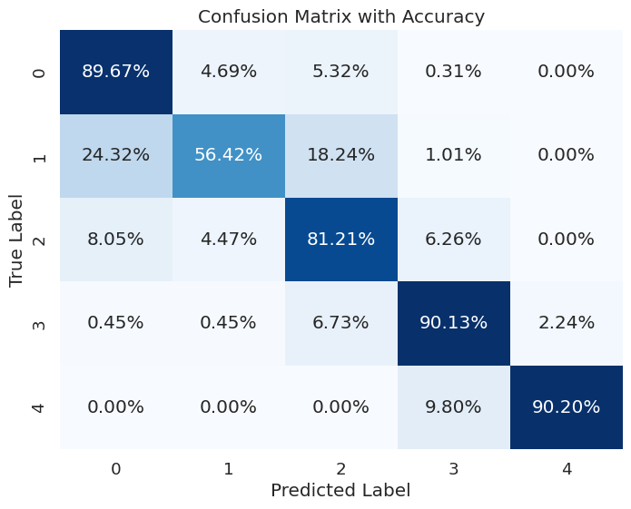

# Classification of Knee Osteoarthritis based on KL grades using Computer Vision

## Description
This project focuses on using computer vision techniques to classify Knee Osteoarthritis (OA) severity based on Kellgren-Lawrence (KL) grades. KL grades are commonly used to assess the progression of knee OA through radiographic imaging. By leveraging deep learning and ordinal classification techniques, specifically using CNN (VGG 19) architecture and PyTorch framework, the project aims to automate the grading process, providing a more objective assessment compared to traditional methods.

## Technologies Used
- PyTorch
- CNN (VGG 19)
- Transfer Learning
- Ordinal classification techniques based on referenced paper ([arxiv 2111.08851v5](https://arxiv.org/pdf/2111.08851))

## Features
- Automated classification of knee OA severity into KL grades using deep learning.
- Utilization of CNN (VGG 19) for feature extraction and classification.
- Ordinal classification approach for handling ordinal KL grades.

## Metrics
- **Model Accuracy**:Achieved an accuracy of 81.57% on test data.
- **Confusion Matrix**: 

